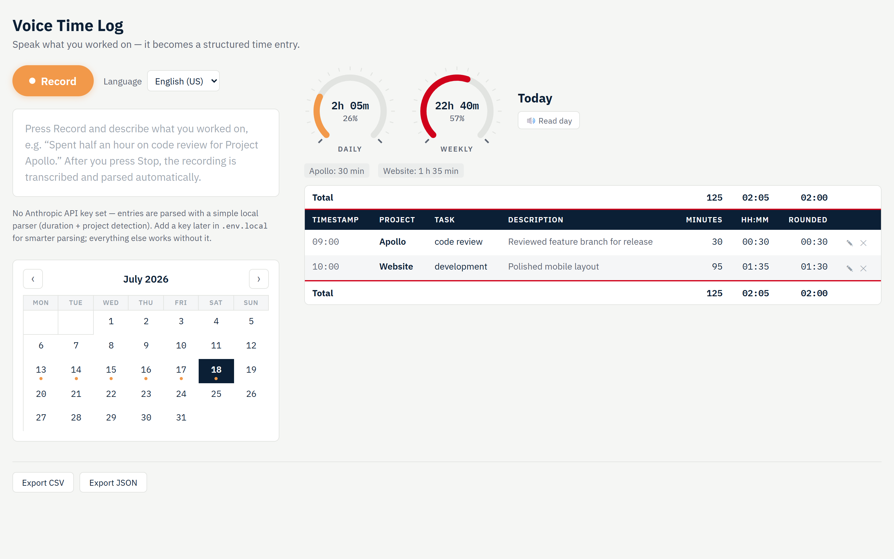

# Voice Time Log

Log your work time by speaking. Press record, say what you worked on — the app
transcribes it locally with Whisper, extracts structured fields (project, task,
description, duration), and files the entry under the right day. Browse your
log in a calendar, watch daily/weekly progress gauges, have any day read back
to you, and export everything to CSV/JSON.

Runs fully local: speech recognition happens on your machine (no cloud speech
service), and all entries are stored on your device.



## Features

- 🎙️ **Voice entry** — record a sentence like *"Spent half an hour on code
  review for project Apollo"*; Whisper (via transformers.js) transcribes it
  offline in English or German
- 🧠 **Smart parsing** — extracts project, task, description, and minutes
  ("half an hour" → 30). Works out of the box with a built-in parser; add an
  Anthropic API key for higher-quality parsing with Claude
- ✏️ **Review before saving** — every parsed entry appears in an editable form
  (including the date it belongs to) before it is committed
- 📅 **Calendar** — month grid with markers on logged days; click any day to
  view or log against it
- ⏱️ **Dial gauges** — daily progress vs. an 8-hour target and weekly progress
  vs. 40 hours
- 📋 **Day table** — timestamp, project, task, description, minutes, hh:mm,
  and 15-minute-rounded columns with totals; edit or delete any entry
- 🔊 **Read day aloud** — spoken summary of any day via speech synthesis
- 📤 **Export** — full log as CSV (Excel-friendly) or JSON
- 💻 **Desktop app** — ships as a Windows installer via Electron, or runs in
  any Chromium browser

## Prerequisites

- [Node.js](https://nodejs.org/) 20 or newer (includes npm)
- Internet connection on first run only — the Whisper speech model (~150 MB)
  is downloaded once and cached locally; afterwards transcription works offline
- A microphone

## Installation

```bash
git clone https://github.com/economyofscale/daniel-voice-time-log.git
cd daniel-voice-time-log
npm install
```

> If your environment blocks npm install scripts, allow them for `electron`
> and `esbuild` (e.g. `npm install-scripts approve electron`) and re-run
> `npm install` — Electron needs its script to download its binary.

## Running it

**Option 1 — in the browser (quickest):**

```bash
npm run dev
```

Open http://localhost:5173 in Chrome or Edge.

**Option 2 — desktop app from source:**

```bash
npm run electron:dev
```

**Option 3 — build a Windows installer:**

```bash
npm run electron:build
```

The installer lands in `release/Voice Time Log Setup <version>.exe` — run it
to install with a Start Menu entry and desktop shortcut.

## Usage

1. On first launch, wait for the one-time speech model download (progress is
   shown; the Record button enables when ready).
2. Pick your language (English/Deutsch) — it's passed to Whisper directly.
3. Press **Record**, describe your work, press **Stop**. Mention the project
   ("project Apollo" / "Projekt Website"), optionally the task ("task code
   review" / "Aufgabe Doku" — or just say "meeting", "bug fix", …), and the
   duration ("45 minutes", "eine halbe Stunde").
4. Check the parsed fields in the review form, adjust anything (including the
   date), and **Save**.
5. Browse days via the calendar; edit (✎) or delete (✕) entries in the table;
   use **Read day** for a spoken summary; export via the footer buttons.

Entries save to whichever day is selected in the calendar (today by default).

## Optional: Claude-powered parsing

Without configuration, a built-in parser extracts the fields locally. For
smarter parsing (better handling of free-form phrasing), create a file named
`.env.local` in the project root:

```
VITE_ANTHROPIC_API_KEY=sk-ant-your-key-here
```

Get a key at [platform.claude.com](https://platform.claude.com/). The key
stays on your machine (`.env.local` is gitignored). If the API is
unavailable, the app falls back to the local parser automatically.

## Data & privacy

- Entries are stored in your browser's/app's local IndexedDB — nothing leaves
  your device unless you configure the Claude API (then only the transcript
  text is sent for parsing)
- The browser version and the desktop app keep **separate** databases
- Use **Export JSON** as your backup mechanism

## Tech stack

React + Vite · [transformers.js](https://github.com/xenova/transformers.js)
(Whisper, WASM) · MediaRecorder & Web Speech Synthesis APIs · IndexedDB
([idb](https://github.com/jakearchibald/idb)) · Electron + electron-builder ·
optional Anthropic SDK

## License

[MIT](LICENSE) — free to use, modify, and redistribute.
